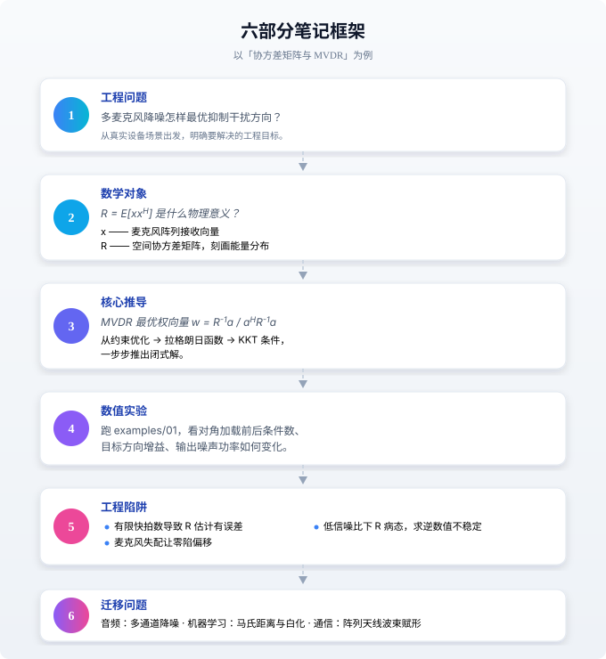

<div align="center">

# 智能穿戴设备的数学基础

**不把数学停留在定理和习题里 —— 每一个公式，都对应一个真实的工程问题。**

*From matrix analysis to statistical learning theory, connected to real-world audio algorithms, array signal processing, and wearable device engineering.*

[](https://www.python.org/)
[](https://numpy.org/)
[](LICENSE)
[](CONTRIBUTING.md)
[](https://github.com/WonderfulClaire/smart-wearable-math-foundations/stargazers)

**简体中文** · [English](README_en.md)

[四门课与真实任务](#-四门课与真实任务) · [六部分框架](#-六部分笔记框架) · [快速开始](#-快速开始) · [学习路线](#-推荐学习路线) · [贡献指南](CONTRIBUTING.md)

</div>

---

> [!NOTE]
> **Datawhale 立项筹划版**：本项目正在按照 Datawhale 开源项目规范完善内容，尚未正式立项或迁入 Datawhale。当前进度和里程碑见 [《Datawhale 立项建设计划》](DATAWHALE_PLAN.md)。

## 💡 为什么做这个仓库？

你是不是也有这种感觉：

> 矩阵分析、随机过程、凸优化……课都学过，定理也背过，
> 但一看到音频算法、阵列信号处理的论文，还是一脸懵——
> **这些公式到底对应设备里的哪一块？理想假设在真实传感器上为什么会失效？**

市面上的数学教材讲定理，工程论文讲结论，中间缺了一座桥。

**这个仓库就是那座桥。**

面向希望进入**智能耳机、智能眼镜、手表、手环、助听设备、多传感器终端算法**领域的学习者，把四门核心数学课——**矩阵分析、随机过程、凸优化、统计学习理论**——重新讲一遍，但每一个知识点都从一个真实的工程问题出发。

---

## ✨ 核心特色

### 🎯 从工程问题出发，不是从定理出发
每一章开头先抛一个真实问题（"多麦克风信号怎样联合表示？噪声能量怎样度量？"），然后再引入数学工具。学完立刻知道"这个公式能解决什么问题"。

### 🧩 六部分标准化笔记框架
每篇笔记固定包含六个部分，形成完整闭环——见下方框架图。

### 🔬 可运行的数值实验
`examples/` 下五个最小实验，**仅依赖 NumPy**，直接 `python` 跑就能看到诊断数字（条件数、奇异值、噪声功率、跨用户准确率落差等），改参数、看效果、建立直觉。

### 🌉 跨领域迁移
同一个数学概念，在阵列信号、音频算法、机器学习里怎么用——打通来看，理解更深刻。

---

## 📚 四门课与真实任务

| 数学主线 | 典型知识点 | 穿戴设备中的问题 | 对应算法 |
|:--------:|-----------|-----------------|----------|
| [**矩阵分析**](01-矩阵分析/README.md) | 复数向量、Hermitian 矩阵、二次型、特征分解、SVD | 多麦克风信号怎样联合表示？噪声能量怎样度量？ | SCM、MVDR、PCA、低秩压缩 |
| [**随机过程**](02-随机过程/README.md) | 平稳性、自相关、PSD、随机状态空间 | 运动伪影和环境噪声为什么随时间变化？ | 谱估计、Wiener 滤波、Kalman 滤波 |
| [**凸优化**](03-凸优化/README.md) | 凸集、拉格朗日乘子、KKT、正则化 | 怎样在保真、降噪、功耗之间求可解释的最优解？ | MVDR、最小二乘、稀疏恢复、传感器标定 |
| [**统计学习理论**](04-统计学习理论/README.md) | 泛化、偏差—方差、正则化、分布偏移 | 离线准确率很高，为什么换用户或换佩戴位置就失效？ | 活动识别、健康指标估计、跨设备评测 |

---

## 🧭 教程目录与完成状态

状态说明：✅ 已形成可学习正文；🚧 正在扩写；⬜ 尚未开始。项目以“正文、推导、实验、工程陷阱、练习和参考资料齐备”为单章完成标准。

| 单元 | 学习目标 | 状态 |
|---|---|:---:|
| [1. 多通道复数向量与 Hermitian 结构](01-矩阵分析/01-多通道复数向量与-Hermitian-结构.md) | 能把麦克风、IMU、PPG 观测写成维度和物理意义明确的向量 | ✅ |
| [2. 协方差矩阵、二次型与 MVDR](01-矩阵分析/02-协方差矩阵、二次型与-MVDR.md) | 从输出功率推导 MVDR，并诊断病态协方差 | ✅ |
| [3. 特征分解、SVD 与低秩结构](01-矩阵分析/03-特征分解、SVD-与低秩结构.md) | 解释信号子空间、PCA 和低秩去噪 | ✅ |
| [4. 平稳性、自相关与 PSD](02-随机过程/01-平稳性、自相关与-PSD.md) | 理解有限数据上的谱估计与局部平稳假设 | ✅ |
| 5. 状态空间与 Kalman 滤波 | 用带噪观测追踪姿态、心率等隐藏状态 | ⬜ |
| [6. 凸优化、约束与正则化](03-凸优化/README.md) | 从工程约束写出目标函数并解释正则项 | 🚧 |
| [7. 泛化、分布偏移与可信评测](04-统计学习理论/README.md) | 设计跨用户、跨设备、跨佩戴位置评测 | 🚧 |
| 8. 多传感器综合案例 | 串联音频、IMU、PPG 的建模、优化和评测 | ⬜ |

五个配套最小实验均已可运行。当前已完成 4/8 个学习单元，达到计划范围的 50%。更细的交付边界和内测计划见 [DATAWHALE_PLAN.md](DATAWHALE_PLAN.md)。

---

## 🔬 六部分笔记框架

以「协方差矩阵与 MVDR」为例：



---

## 🚀 快速开始

### 在线阅读

项目已配置 VitePress 在线站点。合并本次筹划版改造并在仓库 Pages 设置中选择 **GitHub Actions** 后，可通过以下地址阅读：

https://wonderfulclaire.github.io/smart-wearable-math-foundations/

### 环境要求
- Python 3.10+
- NumPy（`examples/` 仅需 NumPy）
- Node.js 20 或 22（仅在本地构建在线文档时需要）

### 三步跑通第一个实验

```bash
# 1. 克隆仓库
git clone https://github.com/WonderfulClaire/smart-wearable-math-foundations.git
cd smart-wearable-math-foundations

# 2. 安装依赖
pip install -r requirements.txt

# 3. 运行第一个实验：协方差与 MVDR（对角加载稳定化）
python examples/01_covariance_and_mvdr.py
```

会打印协方差特征值、对角加载前后的条件数、目标方向增益与输出噪声功率对比。

### 运行全部五个实验
```bash
python examples/01_covariance_and_mvdr.py      # 矩阵分析：协方差与 MVDR
python examples/02_psd_estimation.py           # 随机过程：周期图 vs Welch 谱估计
python examples/03_regularized_sensor_fusion.py # 凸优化：L2 正则化传感器融合
python examples/04_domain_shift_evaluation.py  # 统计学习：随机切分 vs 按用户留出
python examples/05_low_rank_denoising.py       # 矩阵分析：SVD 与低秩去噪
```

---

## 📁 项目结构

```
smart-wearable-math-foundations/
├── 01-矩阵分析/              # 矩阵分析笔记
├── 02-随机过程/              # 随机过程笔记
├── 03-凸优化/                # 凸优化笔记
├── 04-统计学习理论/          # 统计学习理论笔记
├── examples/                # 五个最小可运行实验（仅需 NumPy）
│   ├── 01_covariance_and_mvdr.py
│   ├── 02_psd_estimation.py
│   ├── 03_regularized_sensor_fusion.py
│   ├── 04_domain_shift_evaluation.py
│   └── 05_low_rank_denoising.py
├── docs/                    # 学习路线与笔记模板
│   ├── 学习路线.md
│   ├── 笔记模板.md
│   ├── 引用与版权说明.md
│   └── 内测方案.md
├── DATAWHALE_PLAN.md        # 立项建设计划与完成度口径
├── DATAWHALE_APPLICATION.md # Datawhale 立项申请草案
├── requirements.txt         # 依赖清单
├── CONTRIBUTING.md          # 贡献指南
├── LICENSE                  # MIT 许可证
└── README.md                # 你正在看的文件
```

---

## 🛤️ 推荐学习路线

- **第 1–2 周：矩阵分析** —— 看懂协方差矩阵、二次型和 MVDR。
- **第 3–4 周：随机过程** —— 理解 PSD、局部平稳和传感器噪声建模。
- **第 5 周：凸优化** —— 能从工程约束写出目标函数，并推导一个闭式解。
- **第 6 周：统计学习理论** —— 能设计跨用户、跨设备、跨场景的可信评测。
- **第 7–8 周：项目复盘** —— 完成四个小实验，写一篇贯通四门课的复盘。

更细的顺序见 [docs/学习路线.md](docs/学习路线.md)。

---

## 🎯 适合谁？

- **想入行智能穿戴算法的学生**：系统建立数学 → 工程的连接
- **音频 / 阵列信号工程师**：补数学基础，理解算法底层原理
- **机器学习工程师转 wearable 方向**：快速建立信号处理直觉
- **对智能眼镜、耳机算法好奇的开发者**：从零开始的入门路径

---

## 👥 项目团队与联系

| 成员 | 职责 | 联系方式 |
|---|---|---|
| [WonderfulClaire](https://github.com/WonderfulClaire) | 项目负责人、内容策划、实验维护 | [GitHub Issues](https://github.com/WonderfulClaire/smart-wearable-math-foundations/issues) |

目前由项目负责人独立维护，欢迎熟悉矩阵分析、随机过程、优化、统计学习或穿戴式传感器的贡献者加入。公开问题和内容讨论统一通过 GitHub Issues 留档。

---

## 🤝 贡献

欢迎补充知识点、推导、图解和实验——但不接受只有定义、没有工程问题的孤立笔记。请先读 [CONTRIBUTING.md](CONTRIBUTING.md) 和 [docs/笔记模板.md](docs/笔记模板.md)。

<a href="https://github.com/WonderfulClaire/smart-wearable-math-foundations/graphs/contributors">
  
</a>

---

## 📄 许可证

内容与代码采用 [MIT License](LICENSE)。引用、改编和事实核查规则见 [《引用与版权说明》](docs/引用与版权说明.md)；引用本仓库时，也请保留原始论文、教材或官方文档的出处。

## 🐳 关于 Datawhale

[Datawhale](https://github.com/datawhalechina) 是一个专注于 AI 领域的开源学习社区，倡导 “for the learner，和学习者一起成长”。本仓库目前处于立项筹划阶段，尚不代表 Datawhale 官方项目；后续将按照其公开的[开源项目指南](https://github.com/datawhalechina/DOPMC/blob/main/GUIDE.md)推进立项、内测、公测与毕业。

<div align="center">

**如果这个仓库对你有帮助，点个 ⭐ Star 支持一下吧！**

</div>
